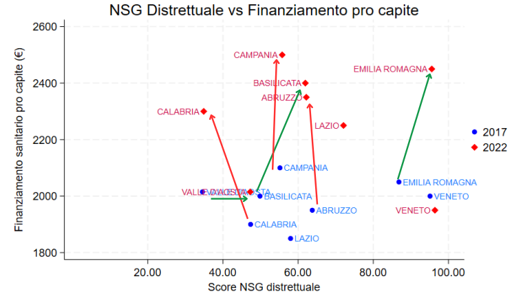

# Analisi del Nuovo Sistema di Garanzia (NSG) [2017–2022]
Analisi degli indicatori CORE e NOCORE dell'area distrettuale italiana per il periodo 2017–2022, con focus sull'Emilia-Romagna e confronto con regioni simili. Lo studio include modelli di regressione, analisi descrittiva e grafici di visualizzazione.

## Obiettivi
- Valutare l'andamento degli indicatori NSG a livello regionale.
- Identificare differenze significative tra le regioni italiane.
- Modellizzare la relazione tra indicatori socio-sanitari tramite regressione.
- Confrontare le performance dell'Emilia-Romagna con regioni simili.

## Dati
- Fonte: Ministero della Salute, NSG 2017–2022
- Variabili principali: indicatori CORE e NOCORE dell'area distrettuale
- Note: alcuni indicatori richiedevano pulizia e normalizzazione dei dati

## Metodologia
- Pulizia e gestione dei dati (Excel e Python/R)
- Analisi descrittiva e comparativa
- Modelli di regressione lineare su Gretl e Stata
- Test su normalità dei residui, eteroschedasticità ed errori robusti
- Grafici Stata

## Risultati principali
- Evidenziate differenze territoriali significative sugli indicatori CORE
- Alcune aree mostrano criticità specifiche
- L'Emilia-Romagna risulta generalmente performante rispetto a regioni simili

## Software usati
- Stata
- Excel
  
)

*Confronto tra regioni simili all’Emilia-Romagna (per finanzianmento sanitario) sul finanziamento sanitario pro-capite e sul punteggio distrettuale NSG (2017–2022)*

## Contatti
- LinkedIn: [riccardomerighi](https://www.linkedin.com/in/riccardo-merighi-62150b340/)
